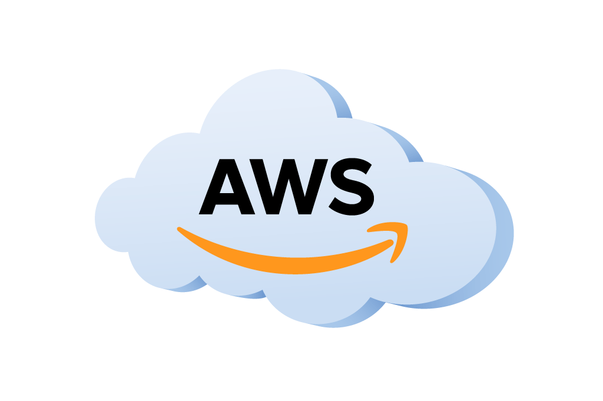

# 
<ins>Spark vs PC en Nube</ins>

  
  &nbsp;&nbsp;&nbsp;&nbsp;
  
  

1. Spark en un clúster  
- Cuando usamos Apache Spark en un clúster, el trabajo se distribuye entre muchas computadoras que trabajan en paralelo. Spark está diseñado específicamente para procesar grandes cantidades de datos en paralelo en múltiples nodos. Las ventajas de Spark en un clúster son:

   - Procesamiento distribuido: Los datos se dividen entre varios nodos y se procesan al mismo tiempo.
Escalabilidad masiva: Si tienes un clúster con 100 nodos, puedes procesar gigabytes o incluso terabytes de datos rápidamente.
Tolerancia a fallos: Si un nodo falla, Spark puede redistribuir las tareas a otros nodos y continuar con el procesamiento sin perder datos.

2. Usar una PC en la nube (Google Cloud o Amazon Web Services) 
- Cuando creas una computadora virtual en la nube, como en Google Cloud o Amazon Web Services (AWS), básicamente estás alquilando una sola máquina (o varias, pero sin la configuración de Spark) que tiene acceso a recursos de computación (procesadores, memoria, almacenamiento) que puedes usar a demanda. La diferencia clave es:

  - Computadora única: Aunque puedes acceder a una máquina muy poderosa en la nube, solo es una computadora con una cantidad limitada de recursos. Si intentas procesar grandes volúmenes de datos en una sola máquina, el proceso será mucho más lento y puede que no sea lo suficientemente grande para manejar todos los datos.

  - Escalabilidad limitada: Aunque en la nube puedes aumentar los recursos (como agregar más CPU o memoria a esa máquina), aún estás limitado a lo que puede hacer esa única máquina. Si los datos crecen mucho, llegará un punto en que esa computadora no será suficiente.

  - Sin procesamiento distribuido: Si estás procesando datos con un programa normal en esa computadora en la nube (sin usar Spark), todo el trabajo se hace en ese único equipo, lo que limita la velocidad.

### Comparación directa:  

- Spark en un clúster:

   - Ventaja: Procesa datos en paralelo en múltiples nodos.
   - Ventaja: Puede manejar enormes volúmenes de datos.
   - Ventaja: Si un nodo falla, no pierdes el trabajo.
   - Ideal para: Grandes empresas que tienen enormes cantidades de datos que necesitan ser procesados rápidamente (terabytes o petabytes).
     
- Computadora en la nube (Google/AWS):

  - Ventaja: Fácil de configurar y usar si solo necesitas una computadora virtual.
  - Desventaja: No procesa datos en paralelo, solo usas los recursos de una única máquina.
  - Desventaja: Menor capacidad para procesar datos muy grandes o muy complejos.
  - Ideal para: Proyectos más pequeños o medianos donde no necesitas distribuir el procesamiento entre múltiples máquinas.
### Ejemplo práctico:
1. Usar Spark en un clúster: Si una empresa como Netflix tiene que analizar millones de horas de visualización de películas y series para sugerir recomendaciones personalizadas a millones de usuarios, usan Spark en un clúster. Dividen los datos en múltiples nodos, cada uno procesando diferentes partes de la información, lo que permite obtener resultados rápidamente.

2. Usar una computadora en la nube: Si tienes un proyecto personal o una pequeña empresa y necesitas procesar datos más modestos, puedes alquilar una máquina virtual en Google Cloud o AWS. Podrías usar esta computadora para hacer análisis de datos simples o entrenar pequeños modelos de Machine Learning.

## ¿Por qué Spark es mejor en grandes volúmenes de datos?
Cuando trabajas con grandes volúmenes de datos (terabytes o más), una sola computadora, aunque esté en la nube, se queda corta. Spark está diseñado para distribuir el trabajo en muchas computadoras a la vez, lo que acelera el procesamiento y lo hace más eficiente. En un clúster, Spark puede manejar fácilmente tareas que serían imposibles o extremadamente lentas en una sola máquina, incluso si es poderosa.

### Resumen final
- Clúster: Un conjunto de computadoras conectadas que trabajan juntas para procesar grandes cantidades de datos.
- Spark en un clúster: Es ideal para procesar datos muy grandes en paralelo, dividiendo el trabajo entre muchos nodos.
- PC en la nube (Google/AWS): Es útil para trabajos pequeños o medianos, pero no escala bien si necesitas procesar enormes volúmenes de datos, ya que solo tienes una computadora virtual trabajando.
